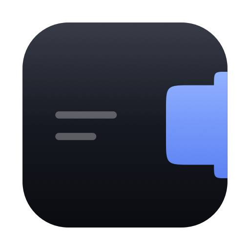
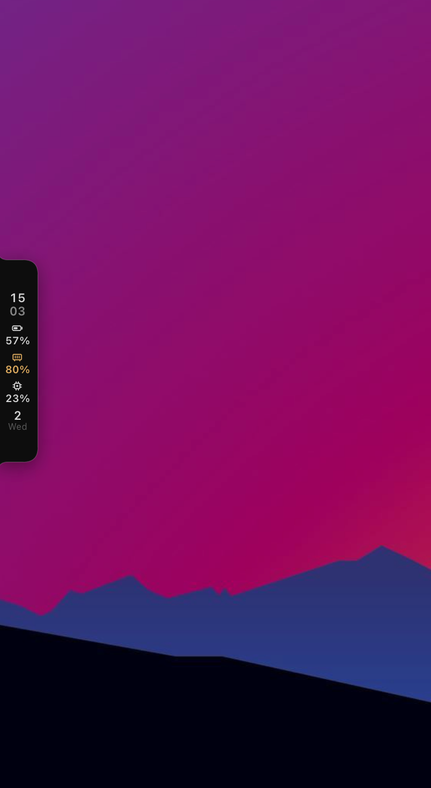
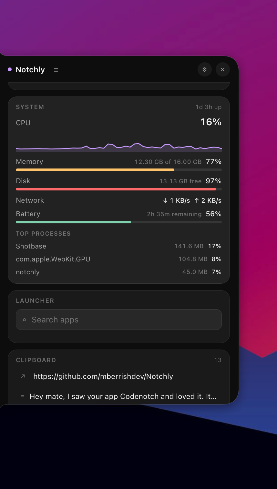

<p align="center">
  
</p>

<h1 align="center">Notchly</h1>

<p align="center"><strong>A notch-shaped panel for your desktop.</strong><br />
Dock it to any edge. Fill it with widgets.</p>

<p align="center">
  <a href="https://github.com/mberrishdev/Notchly/releases/latest"></a>
  <a href="https://github.com/mberrishdev/Notchly/actions/workflows/ci.yml"></a>
  
  
</p>

Notchly puts a small Handle on the edge of your screen. It opens into a full Panel for
widgets, shortcuts, system information, media controls, and clipboard history.

The Panel can dock to the top, bottom, left, or right edge. You can move it, resize it,
choose what the closed Handle shows, and add your own widgets as plain HTML/CSS/JS
folders.

<table align="center">
  <tr>
    <td align="center" width="50%"></td>
    <td align="center" width="50%"></td>
  </tr>
  <tr>
    <td align="center">The closed Handle, showing Idle Chips.</td>
    <td align="center">The open Panel, hosting widgets.</td>
  </tr>
</table>

## Download

Download the latest draft or published release from
[GitHub Releases](https://github.com/mberrishdev/Notchly/releases).

| Platform | Download |
| --- | --- |
| macOS, Apple Silicon | `aarch64.dmg` |
| macOS, Intel | `x64.dmg` |
| Windows | `x64-setup.exe` |

Notchly has no Dock or taskbar icon. Look for the Handle on the edge of your display,
or its icon in the menu bar or system tray.

These builds are currently unsigned. On macOS, Gatekeeper may report the app as
damaged. Clear the quarantine flag before opening it:

```bash
xattr -dr com.apple.quarantine /Applications/Notchly.app
```

On Windows, choose **More info** and then **Run anyway** in the SmartScreen dialog.

## Build From Source

Requirements:

- macOS or Windows
- [Rust](https://rustup.rs)
- Node.js and npm

Clone the repository and install the frontend dependencies:

```bash
git clone https://github.com/mberrishdev/Notchly.git
cd Notchly
npm install
```

Run the app with hot reload:

```bash
npx tauri dev
```

Build a release bundle for the current platform:

```bash
npx tauri build
```

Windows builds are produced in CI and have not yet been validated on Windows hardware.

## Built-in Widgets

- **Clock**: time, date, and week number.
- **Now Playing**: playback controls for Music and Spotify.
- **System**: CPU, memory, disk, network, and battery information.
- **Quick Launcher**: search for and launch installed applications.
- **Clipboard**: searchable history of copied text.

The closed Handle can show Idle Chips such as the clock, CPU, memory, battery, media
activity, clipboard count, and the icons of enabled widgets. Chips reserve their space,
so the Handle does not move when a value appears or disappears.

## Customize It

- Dock the Panel to any display edge.
- Drag the Handle to reposition it or move it across the display to change edges.
- Open with hover, click, or a global hotkey.
- Adjust open and close delays, size, corner radius, opacity, and accent color.
- Choose an optional display and launch Notchly at login.
- Set the Handle's Idle Chips and reorder them by dragging.

## Create A Widget

A widget is a folder containing a manifest and an HTML entry point:

```text
my-widget/
  widget.json
  index.html
```

Notchly ships five example widgets — a pomodoro, weather, a calendar (**Up Next**), a
**GitHub** status panel, and a shell command strip — copied into your widgets folder on
first launch and meant to be read and pulled apart.

Place it in the Notchly Widgets folder, or use **Settings > Custom Widgets > Create**.
Notchly discovers the folder automatically and reloads it when its files change.

Widgets can declare settings and request access to system data, notifications, network,
clipboard history, or shell commands. Sensitive permissions are disabled until granted
in Settings.

Read the complete widget reference in [docs/WidgetAPI.md](docs/WidgetAPI.md).

## Privacy

Notchly does not collect analytics or make network requests of its own. Network access
belongs to widgets and is disabled until you grant it.

Clipboard history is stored locally, unencrypted, in the application's support folder.
macOS may ask for Automation access when Now Playing reads Music or Spotify.

## Development

The project uses a Rust core and a plain HTML/CSS/JS frontend. The domain model and
terminology are defined in [CONTEXT.md](CONTEXT.md). Repository structure and engineering
decisions are documented in [CLAUDE.md](CLAUDE.md).

Run the Rust test suite and linter:

```bash
cd core
cargo test --locked
cargo clippy --locked --all-targets -- -D warnings
```

See [docs/RELEASING.md](docs/RELEASING.md) for the release process.

## License

MIT
